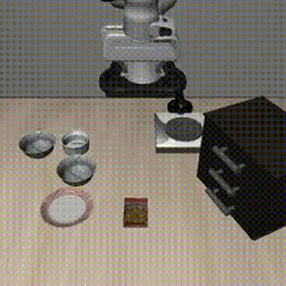
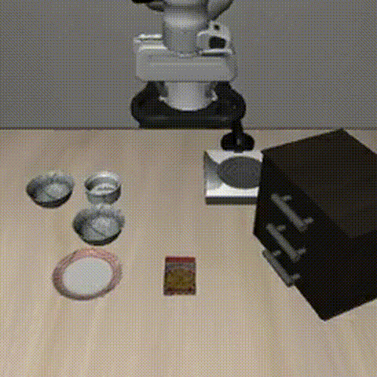
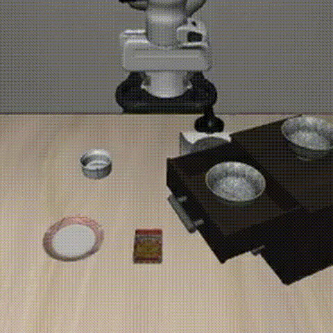
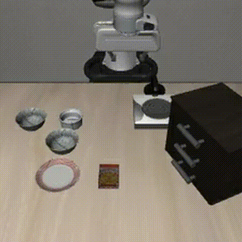
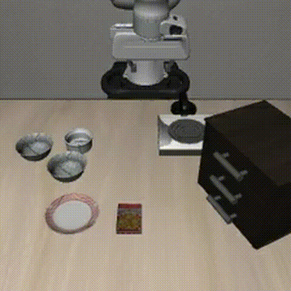
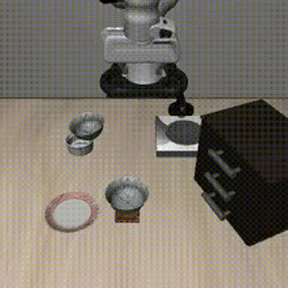

# OpenVLA-LoRA 微调项目

A800 80G

torchrun --standalone --nnodes 1 --nproc-per-node 1 vla-scripts/finetune.py \
  --vla_path "openvla/openvla-7b" \
  --data_root_dir "/datadisk/datasets/openvla-libero-spatial" \
  --dataset_name "libero_spatial_no_noops" \
  --run_root_dir "/datadisk/checkpoints" \
  --adapter_tmp_dir "/datadisk/adapter_tmp" \
  --lora_rank 32 \
  --batch_size 16 \
  --grad_accumulation_steps 1 \
  --learning_rate 5e-4 \
  --image_aug True \
  --wandb_project "openvla-finetune" \
  --wandb_entity "zsccyd" \
  --save_steps 500 \
  --max_steps 8000

## 结果总览

- `8000 steps`：评估脚本成功率 `52%`，肉眼观察约 `70%`。
- `6500 steps`：评估脚本成功率 `78%`，肉眼观察约 `82%`。
- 结论：`6500 steps` 综合表现更好。

---

## 关键现象

在 `8000 steps` 的结果中出现明显分化：

- 成功样本：抓取动作连贯、执行流畅。
- 失败样本：机械臂“完全不动”（不是抓偏，而是冻结）。

这类现象可归纳为 `Freezing / Action Collapse`：策略在不确定状态下收缩到“近零动作”的局部最优。

---

## 视频展示（动图）

| 任务（Task） | 结果 | 动图预览 |
|---|---|---|
| pick up black bowl between plate and ramekin | ✅ 成功 |  |
| pick up black bowl between plate and ramekin | ✅ 成功 |  |
| pick up black bowl in top drawer | ✅ 成功 |  |
| pick up black bowl between plate and ramekin | ❌ 失败 |  |
| pick up black bowl between plate and ramekin | ❌ 失败 |  |
| pick up black bowl on ramekin and place it | ❌ 失败 |  |

---

## 关于 `UNNORM_KEY = "bridge_orig"` 与“机械臂不动”

- 用了不匹配当前任务分布的统计量（例如在 LIBERO 任务上强行使用 `bridge_orig`）。
- 或者微调权重目录下缺失 `dataset_statistics.json`，导致动作尺度恢复异常。

这两种情况都可能让动作幅值被压缩，表现成“几乎不动”，看起来与微调前类似。

### 这次如何确认并修正

在本仓库的 LIBERO 评测逻辑中（`experiments/robot/libero/run_libero_eval.py`）：

1. 默认 `cfg.unnorm_key = cfg.task_suite_name`（例如 `libero_spatial`）。
2. 若该 key 不存在，会自动尝试 `libero_spatial_no_noops`。
3. 若仍不存在，直接报错，而不是静默改用 `bridge_orig`。

因此，正确做法是：

- **LIBERO 评测使用 LIBERO 对应统计量**（`libero_spatial` 或 `libero_spatial_no_noops`）。
- **确保微调 checkpoint 中带有 `dataset_statistics.json`** 并被加载。
- 不在 LIBERO 评测里手工强制设成 `bridge_orig`。

### 复盘结论

早期“只能用 `bridge_orig`”的经验更接近于 **Bridge/通用验证脚本场景**；迁移到 LIBERO-Spatial 后，应使用 LIBERO 对应的反归一化统计量。这个问题修正后，配合 checkpoint 选择（`6500 steps`）效果更稳定。

---

## 补充分析

### 为什么 5000 与 8000 差异明显？

这是典型的 Bias-Variance 权衡：

- `5000 steps`：更敢动，但抓取精度不稳定（失败多为抓偏/掉落）。
- `8000 steps`：熟悉场景很稳；陌生初始状态下更易冻结（直接不动）。

### 为什么脚本与肉眼有差异？

LIBERO 判定通常更严格（位置、姿态、稳定时长等几何约束），因此“看起来完成”不一定计入 benchmark 成功。报告中应以脚本结果为主，人工观察用于补充行为分析。

---

## 后续可复现实验建议

1. 评估 `6000~7000` 的中间 checkpoint 做早停选择。
2. 若重训，建议使用 `dropout=0.1`（避免 `dropout=0.0` 导致过拟合）。
3. 评估时增加 episode 数量（如 `20/50`），降低单次初始化偏差。
